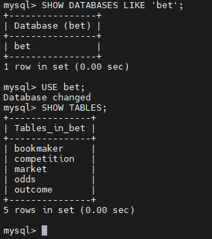
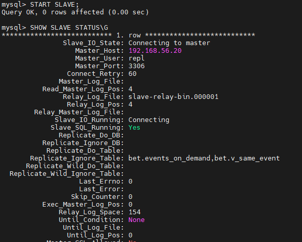
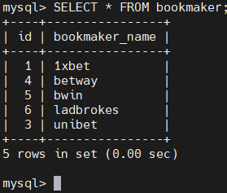
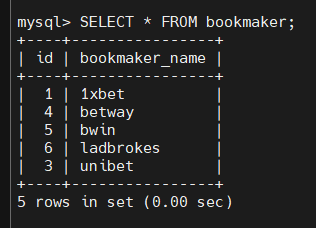
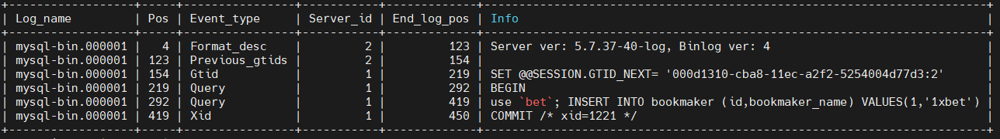

# HW28 - Репликация mysql

Поднимаем стенд Vagrant (master 192.168.56.10 и slave 192.168.56.20) с установкой mysql
Конфиги копирутся отдельно для master (server_id=1) и slave (server_id=2)

> [Инструкция](https://www.percona.com/doc/percona-server/5.7/installation/yum_repo.html#installing-percona-server-from-percona-yum-repository)  
> Cтенд для повторения всех команд можно взять [отсюда](https://gitlab.com/otus_linux/stands-mysql)

По умолчанию Percona хранит файлы в таком виде:

- Основной конфиг в /etc/my.cnf
- Так же инклудится директориā /etc/my.cnf.d/ - куда мы и будем складывать наши конфиги
- Дата файлы в /var/lib/mysql


> При установке Percona автоматически генерирует пароль для пользователя root и кладет его в файл /var/log/mysqld.log

```
cat /var/log/mysqld.log | grep 'root@localhost:' | awk '{print $11}'
```

- Подключаемся к mysql и меняем пароль для доступа к полному функционалу

```
mysql -uroot -p 'старый пароль'

ALTER USER USER() IDENTIFIED BY 'новый пароль';
```
Для входа без пароля в дальнейшем можно использовать
```
mysql_config_editor set --user=root --password
```

Репликацию будем настраивать с использованием GTID. Что это такое и зачем это надо можно почитать [здесь](https://dev.mysql.com/doc/refman/5.6/en/replication-gtids-concepts.html).

Следует обратить внимание, что атрибут server-id на мастер-сервере должен обязательно отличаться от server-id слейв-сервера. Проверить какая переменная установлена в текущий момент можно следующим образом

```
SELECT @@server_id;

+-------------+
| @@server_id |
+-------------+
|           1 |
+-------------+
1 row in set (0.00 sec)
```

- Убеждаемся что GTID включен

```
SHOW VARIABLES LIKE 'gtid_mode';

+---------------+-------+
| Variable_name | Value |
+---------------+-------+
| gtid_mode     | ON    |
+---------------+-------+
1 row in set (0.00 sec)
```

- Создадим тестовую базу bet и загрузим в нее дамп и проверим

```
CREATE DATABASE bet;

Query OK, 1 row affected (0.00 sec)
```

```
mysql -uroot -p -D bet < /vagrant/bet.dmp
```

```
USE bet;
SHOW TABLES;

+------------------+
| Tables_in_bet    |
+------------------+
| bookmaker        |
| competition      |
| events_on_demand |
| market           |
| odds             |
| outcome          |
| v_same_event     |
+------------------+
7 rows in set (0.00 sec)
```

- Создадим пользователя для репликации и даем ему права на эту самую репликацию

```
CREATE USER 'repl'@'%' IDENTIFIED BY '!OtusLinux2018';
SELECT user,host FROM mysql.user where user='repl';

+------+------+
| user | host |
+------+------+
| repl | %    |
+------+------+
1 row in set (0.00 sec)

GRANT REPLICATION SLAVE ON *.* TO 'repl'@'%' IDENTIFIED BY '!OtusLinux2018';
```

- Дампим базу для последующего залива на слейв и игнорируем таблицу по заданию

```
mysqldump --all-databases --triggers --routines --master-data --ignore-table=bet.events_on_demand --ignore-table=bet.v_same_event -uroot -p > /vagrant/master.sql
```

- копируем дамп на slave


> На этом настройка Master-а завершена. Заливаем дамп мастера и убеждаемся, что база есть и она без лишних таблиц

```


SOURCE /vagrant/master.sql

```


> видим что таблиц v_same_event и events_on_demand нет

- Ну и собственно подключаем и запускаем слейв

```
CHANGE MASTER TO MASTER_HOST = "192.168.56.10", MASTER_PORT = 3306, MASTER_USER = "repl", MASTER_PASSWORD = "!OtusLinux2018", MASTER_AUTO_POSITION = 1;
START SLAVE;
SHOW SLAVE STATUS\G




- Видно что репликация работает, gtid работает и игнорятся таблички по заданию

- Проверим репликацю в действии. На мастере

```
USE bet;
INSERT INTO bookmaker (id,bookmaker_name) VALUES(1,'1xbet');
SELECT * FROM bookmaker;




- На слейве



- В binlog-ах на cлейве также видно последнее изменение, туда же он пишет информацию о GTID

